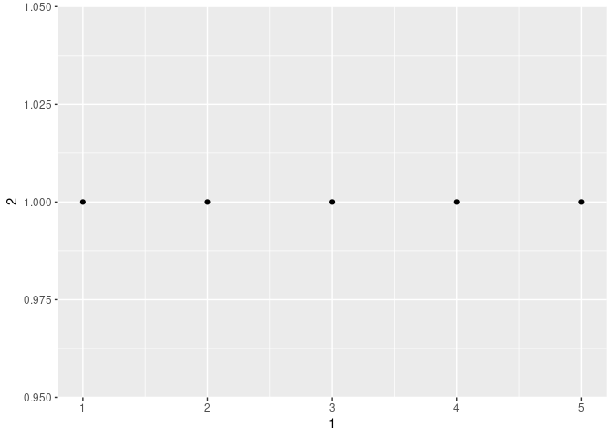

Data Wrangling Assignment
================

Time to learn about
    tibbles

``` r
library(tidyverse)
```

    ## ── Attaching packages ──────────────────────────────────────────────────────────────────────────────────────────────────────── tidyverse 1.2.1 ──

    ## ✔ ggplot2 3.2.1     ✔ purrr   0.3.2
    ## ✔ tibble  2.1.3     ✔ dplyr   0.8.3
    ## ✔ tidyr   1.0.0     ✔ stringr 1.4.0
    ## ✔ readr   1.3.1     ✔ forcats 0.4.0

    ## ── Conflicts ─────────────────────────────────────────────────────────────────────────────────────────────────────────── tidyverse_conflicts() ──
    ## ✖ dplyr::filter() masks stats::filter()
    ## ✖ dplyr::lag()    masks stats::lag()

``` r
#make a data frame into a tibble
as_tibble(iris)
```

    ## # A tibble: 150 x 5
    ##    Sepal.Length Sepal.Width Petal.Length Petal.Width Species
    ##           <dbl>       <dbl>        <dbl>       <dbl> <fct>  
    ##  1          5.1         3.5          1.4         0.2 setosa 
    ##  2          4.9         3            1.4         0.2 setosa 
    ##  3          4.7         3.2          1.3         0.2 setosa 
    ##  4          4.6         3.1          1.5         0.2 setosa 
    ##  5          5           3.6          1.4         0.2 setosa 
    ##  6          5.4         3.9          1.7         0.4 setosa 
    ##  7          4.6         3.4          1.4         0.3 setosa 
    ##  8          5           3.4          1.5         0.2 setosa 
    ##  9          4.4         2.9          1.4         0.2 setosa 
    ## 10          4.9         3.1          1.5         0.1 setosa 
    ## # … with 140 more rows

``` r
tibble(
  x = 1:5,
  y = 1,
  z = x ^2 +y
)
```

    ## # A tibble: 5 x 3
    ##       x     y     z
    ##   <int> <dbl> <dbl>
    ## 1     1     1     2
    ## 2     2     1     5
    ## 3     3     1    10
    ## 4     4     1    17
    ## 5     5     1    26

tibbles can have invalid column names use backticks for these `  ` also
used in ggplot2, dplyr, and tidyr

``` r
tb <- tibble(
  `)` = "smile",
  ` ` = "space",
  `2000` = "number"
)
tb
```

    ## # A tibble: 1 x 3
    ##   `)`   ` `   `2000`
    ##   <chr> <chr> <chr> 
    ## 1 smile space number

``` r
#tribble used to make tibbles
tribble(
  ~x, ~y, ~z,
  #--|--|----
  "a", 2, 3.6,
  "b", 1, 8.5
)
```

    ## # A tibble: 2 x 3
    ##   x         y     z
    ##   <chr> <dbl> <dbl>
    ## 1 a         2   3.6
    ## 2 b         1   8.5

``` r
#how to print more and control it. n is rows.

nycflights13::flights %>%
  print(n = 10, width = Inf)
```

    ## # A tibble: 336,776 x 19
    ##     year month   day dep_time sched_dep_time dep_delay arr_time
    ##    <int> <int> <int>    <int>          <int>     <dbl>    <int>
    ##  1  2013     1     1      517            515         2      830
    ##  2  2013     1     1      533            529         4      850
    ##  3  2013     1     1      542            540         2      923
    ##  4  2013     1     1      544            545        -1     1004
    ##  5  2013     1     1      554            600        -6      812
    ##  6  2013     1     1      554            558        -4      740
    ##  7  2013     1     1      555            600        -5      913
    ##  8  2013     1     1      557            600        -3      709
    ##  9  2013     1     1      557            600        -3      838
    ## 10  2013     1     1      558            600        -2      753
    ##    sched_arr_time arr_delay carrier flight tailnum origin dest  air_time
    ##             <int>     <dbl> <chr>    <int> <chr>   <chr>  <chr>    <dbl>
    ##  1            819        11 UA        1545 N14228  EWR    IAH        227
    ##  2            830        20 UA        1714 N24211  LGA    IAH        227
    ##  3            850        33 AA        1141 N619AA  JFK    MIA        160
    ##  4           1022       -18 B6         725 N804JB  JFK    BQN        183
    ##  5            837       -25 DL         461 N668DN  LGA    ATL        116
    ##  6            728        12 UA        1696 N39463  EWR    ORD        150
    ##  7            854        19 B6         507 N516JB  EWR    FLL        158
    ##  8            723       -14 EV        5708 N829AS  LGA    IAD         53
    ##  9            846        -8 B6          79 N593JB  JFK    MCO        140
    ## 10            745         8 AA         301 N3ALAA  LGA    ORD        138
    ##    distance  hour minute time_hour          
    ##       <dbl> <dbl>  <dbl> <dttm>             
    ##  1     1400     5     15 2013-01-01 05:00:00
    ##  2     1416     5     29 2013-01-01 05:00:00
    ##  3     1089     5     40 2013-01-01 05:00:00
    ##  4     1576     5     45 2013-01-01 05:00:00
    ##  5      762     6      0 2013-01-01 06:00:00
    ##  6      719     5     58 2013-01-01 05:00:00
    ##  7     1065     6      0 2013-01-01 06:00:00
    ##  8      229     6      0 2013-01-01 06:00:00
    ##  9      944     6      0 2013-01-01 06:00:00
    ## 10      733     6      0 2013-01-01 06:00:00
    ## # … with 3.368e+05 more rows

``` r
#or even better
nycflights13::flights %>%
  View()

print(mtcars)
```

    ##                      mpg cyl  disp  hp drat    wt  qsec vs am gear carb
    ## Mazda RX4           21.0   6 160.0 110 3.90 2.620 16.46  0  1    4    4
    ## Mazda RX4 Wag       21.0   6 160.0 110 3.90 2.875 17.02  0  1    4    4
    ## Datsun 710          22.8   4 108.0  93 3.85 2.320 18.61  1  1    4    1
    ## Hornet 4 Drive      21.4   6 258.0 110 3.08 3.215 19.44  1  0    3    1
    ## Hornet Sportabout   18.7   8 360.0 175 3.15 3.440 17.02  0  0    3    2
    ## Valiant             18.1   6 225.0 105 2.76 3.460 20.22  1  0    3    1
    ## Duster 360          14.3   8 360.0 245 3.21 3.570 15.84  0  0    3    4
    ## Merc 240D           24.4   4 146.7  62 3.69 3.190 20.00  1  0    4    2
    ## Merc 230            22.8   4 140.8  95 3.92 3.150 22.90  1  0    4    2
    ## Merc 280            19.2   6 167.6 123 3.92 3.440 18.30  1  0    4    4
    ## Merc 280C           17.8   6 167.6 123 3.92 3.440 18.90  1  0    4    4
    ## Merc 450SE          16.4   8 275.8 180 3.07 4.070 17.40  0  0    3    3
    ## Merc 450SL          17.3   8 275.8 180 3.07 3.730 17.60  0  0    3    3
    ## Merc 450SLC         15.2   8 275.8 180 3.07 3.780 18.00  0  0    3    3
    ## Cadillac Fleetwood  10.4   8 472.0 205 2.93 5.250 17.98  0  0    3    4
    ## Lincoln Continental 10.4   8 460.0 215 3.00 5.424 17.82  0  0    3    4
    ## Chrysler Imperial   14.7   8 440.0 230 3.23 5.345 17.42  0  0    3    4
    ## Fiat 128            32.4   4  78.7  66 4.08 2.200 19.47  1  1    4    1
    ## Honda Civic         30.4   4  75.7  52 4.93 1.615 18.52  1  1    4    2
    ## Toyota Corolla      33.9   4  71.1  65 4.22 1.835 19.90  1  1    4    1
    ## Toyota Corona       21.5   4 120.1  97 3.70 2.465 20.01  1  0    3    1
    ## Dodge Challenger    15.5   8 318.0 150 2.76 3.520 16.87  0  0    3    2
    ## AMC Javelin         15.2   8 304.0 150 3.15 3.435 17.30  0  0    3    2
    ## Camaro Z28          13.3   8 350.0 245 3.73 3.840 15.41  0  0    3    4
    ## Pontiac Firebird    19.2   8 400.0 175 3.08 3.845 17.05  0  0    3    2
    ## Fiat X1-9           27.3   4  79.0  66 4.08 1.935 18.90  1  1    4    1
    ## Porsche 914-2       26.0   4 120.3  91 4.43 2.140 16.70  0  1    5    2
    ## Lotus Europa        30.4   4  95.1 113 3.77 1.513 16.90  1  1    5    2
    ## Ford Pantera L      15.8   8 351.0 264 4.22 3.170 14.50  0  1    5    4
    ## Ferrari Dino        19.7   6 145.0 175 3.62 2.770 15.50  0  1    5    6
    ## Maserati Bora       15.0   8 301.0 335 3.54 3.570 14.60  0  1    5    8
    ## Volvo 142E          21.4   4 121.0 109 4.11 2.780 18.60  1  1    4    2

tibbles show size, header information, type and the first 10 rows with
as many columns as fit on screen.

use $ and \[\[ to extract information. $ will extract by name, and \[\[
will by position

``` r
df <- tibble(
  x = runif(5),
  y = rnorm(5)
)
df$x
```

    ## [1] 0.128882149 0.889729946 0.408965372 0.008754688 0.769437023

``` r
df[["x"]]
```

    ## [1] 0.128882149 0.889729946 0.408965372 0.008754688 0.769437023

``` r
df[[1]]
```

    ## [1] 0.128882149 0.889729946 0.408965372 0.008754688 0.769437023

to use those in a pipe use a period before . %\>% .$x

10.5 Exercises

1.  One is labled tbl\_ the other data.frame when run. dataframe also
    prints all columns
2.  Data frames use an inexact searching method while tibbles are exact

<!-- end list -->

``` r
df <- data.frame(abc = 1, xyz = "a")
df$x
```

    ## [1] a
    ## Levels: a

``` r
df[,"xyz"]
```

    ## [1] a
    ## Levels: a

``` r
df[, c("abc", "xyz")]
```

    ##   abc xyz
    ## 1   1   a

``` r
tbl <- as_tibble(df)
tbl$x
```

    ## Warning: Unknown or uninitialised column: 'x'.

    ## NULL

``` r
tbl[, "xyz"]
```

    ## # A tibble: 1 x 1
    ##   xyz  
    ##   <fct>
    ## 1 a

``` r
tbl[, c("abc", "xyz")]
```

    ## # A tibble: 1 x 2
    ##     abc xyz  
    ##   <dbl> <fct>
    ## 1     1 a

3.  \[\[“mpg”\]\]

4.  
<!-- end list -->

``` r
thing <- tibble(
  `1` = 1:5,
  `2` = 1,
  z = `1` ^2 +`2`
)
thing[["1"]]
```

    ## [1] 1 2 3 4 5

``` r
ggplot(data = thing, aes(x =`1`, y = `2`)) + geom_point()
```

<!-- -->

``` r
thing2 <- mutate(thing, `3` = `2` / `1`)
thing2 <- rename(thing, one = `1`, two = `2`)
```

5.  tiblle::enframe() changes a vector name into a data frame with names
    and values
6.  ?print.tbl, n\_extra changes extra numbers columns.

read\_csv() comma delimted read\_csv2() semicolon delimited read\_tsv()
tab read\_delim() any delimiter???

read\_fwf() fixed width files fwf\_widths() or positions
fwf\_positions(). read\_table columns separated by white space

read\_log() reads APACHE LOGS\! webreadr might be useful

``` r
#heights <- read_csv("data/heights.csv")
```

``` r
read_csv("a,b,c
1,2,3
4,5,6")
```

    ## # A tibble: 2 x 3
    ##       a     b     c
    ##   <dbl> <dbl> <dbl>
    ## 1     1     2     3
    ## 2     4     5     6

``` r
read_csv("The first line of metadata
  The second line of metadata
  x,y,z
  1,2,3", skip = 2)
```

    ## # A tibble: 1 x 3
    ##       x     y     z
    ##   <dbl> <dbl> <dbl>
    ## 1     1     2     3

``` r
# skip is useful for not printing out any metadata that may be on top # = lines skipped alternatively input # to skip all lines containing #


read_csv("# A comment I want to skip
  x,y,z
  1,2,3", comment = "#")
```

    ## # A tibble: 1 x 3
    ##       x     y     z
    ##   <dbl> <dbl> <dbl>
    ## 1     1     2     3

``` r
#if the first row does not have column names set col_names to false

read_csv("1,2,3\n4,5,6", col_names = FALSE)
```

    ## # A tibble: 2 x 3
    ##      X1    X2    X3
    ##   <dbl> <dbl> <dbl>
    ## 1     1     2     3
    ## 2     4     5     6

``` r
#define the column header names to: x y z
read_csv("1,2,3\n4,5,6", col_names = c("x", "y", "z"))
```

    ## # A tibble: 2 x 3
    ##       x     y     z
    ##   <dbl> <dbl> <dbl>
    ## 1     1     2     3
    ## 2     4     5     6

``` r
#define what is the missing value value
read_csv("a,b,c\n1,2,.", na = ".")
```

    ## # A tibble: 1 x 3
    ##       a     b c    
    ##   <dbl> <dbl> <lgl>
    ## 1     1     2 NA

Exercises 1. I would use read\_delim(path, delim =“|”) 2. col\_names,
col\_types, locale, na, quoted\_na, trim\_ws, n\_max, guess\_max,
progress 3. Path name, and col\_positions 4. use read delim with quote =
“’” and delimiter option as “,”

``` r
read_csv("a,b\n1,2,3\n4,5,6")
```

    ## Warning: 2 parsing failures.
    ## row col  expected    actual         file
    ##   1  -- 2 columns 3 columns literal data
    ##   2  -- 2 columns 3 columns literal data

    ## # A tibble: 2 x 2
    ##       a     b
    ##   <dbl> <dbl>
    ## 1     1     2
    ## 2     4     5

``` r
read_csv("a,b,c\n1,2\n1,2,3,4")
```

    ## Warning: 2 parsing failures.
    ## row col  expected    actual         file
    ##   1  -- 3 columns 2 columns literal data
    ##   2  -- 3 columns 4 columns literal data

    ## # A tibble: 2 x 3
    ##       a     b     c
    ##   <dbl> <dbl> <dbl>
    ## 1     1     2    NA
    ## 2     1     2     3

``` r
read_csv("a,b\n1,2\na,b")
```

    ## # A tibble: 2 x 2
    ##   a     b    
    ##   <chr> <chr>
    ## 1 1     2    
    ## 2 a     b

``` r
read_csv("a;b\n1;3")
```

    ## # A tibble: 1 x 1
    ##   `a;b`
    ##   <chr>
    ## 1 1;3

5.  a mismatch of column headers and number of columns in some of the
    rows b miss match of number of columns and data c Open quote, and
    type mismatch d looks fine e semicolon is the delimiter, use csv2
    instead

<!-- end list -->

``` r
#Super useful parser takes data and get it in a useful form

str(parse_logical(c("TRUE", "FALSE", "NA")))
```

    ##  logi [1:3] TRUE FALSE NA

``` r
str(parse_integer(c("1", "2", "3")))
```

    ##  int [1:3] 1 2 3

``` r
str(parse_date(c("2010-01-01", "1979-10-14")))
```

    ##  Date[1:2], format: "2010-01-01" "1979-10-14"

``` r
parse_integer(c("1", "231", ".", "456"), na = ".")
```

    ## [1]   1 231  NA 456

``` r
x <- parse_integer(c("123", "345", "abc", "123.45"))
```

    ## Warning: 2 parsing failures.
    ## row col               expected actual
    ##   3  -- an integer                abc
    ##   4  -- no trailing characters    .45

``` r
x
```

    ## [1] 123 345  NA  NA
    ## attr(,"problems")
    ## # A tibble: 2 x 4
    ##     row   col expected               actual
    ##   <int> <int> <chr>                  <chr> 
    ## 1     3    NA an integer             abc   
    ## 2     4    NA no trailing characters .45

``` r
problems(x)
```

    ## # A tibble: 2 x 4
    ##     row   col expected               actual
    ##   <int> <int> <chr>                  <chr> 
    ## 1     3    NA an integer             abc   
    ## 2     4    NA no trailing characters .45

``` r
parse_double("1.23")
```

    ## [1] 1.23

``` r
parse_double("1,23", locale = locale(decimal_mark = ","))
```

    ## [1] 1.23

``` r
# will ignore non number characters
parse_number("$100")
```

    ## [1] 100

``` r
#> [1] 100
parse_number("20%")
```

    ## [1] 20

``` r
#> [1] 20
parse_number("It cost $123.45")
```

    ## [1] 123.45

``` r
#> [1] 123

# Used in America
parse_number("$123,456,789")
```

    ## [1] 123456789

``` r
#> [1] 1.23e+08

# Used in many parts of Europe
parse_number("123.456.789", locale = locale(grouping_mark = "."))
```

    ## [1] 123456789

``` r
#> [1] 1.23e+08

# Used in Switzerland
parse_number("123'456'789", locale = locale(grouping_mark = "'"))
```

    ## [1] 123456789

``` r
#> [1] 1.23e+08

charToRaw("Hadley")
```

    ## [1] 48 61 64 6c 65 79

``` r
x1 <- "El Ni\xf1o was particularly bad this year"
x2 <- "\x82\xb1\x82\xf1\x82\xc9\x82\xbf\x82\xcd"

x1
```

    ## [1] "El Ni\xf1o was particularly bad this year"

``` r
#> [1] "El Ni\xf1o was particularly bad this year"
x2
```

    ## [1] "\x82\xb1\x82\xf1\x82ɂ\xbf\x82\xcd"

``` r
#> [1] "\x82\xb1\x82\xf1\x82ɂ\xbf\x82\xcd"

parse_character(x1, locale = locale(encoding = "Latin1"))
```

    ## [1] "El Niño was particularly bad this year"

``` r
#> [1] "El Niño was particularly bad this year"
parse_character(x2, locale = locale(encoding = "Shift-JIS"))
```

    ## [1] "こんにちは"

``` r
#> [1] "こんにちは"

guess_encoding(charToRaw(x1))
```

    ## # A tibble: 2 x 2
    ##   encoding   confidence
    ##   <chr>           <dbl>
    ## 1 ISO-8859-1       0.46
    ## 2 ISO-8859-9       0.23

``` r
#> # A tibble: 2 x 2
#>   encoding   confidence
#>   <chr>           <dbl>
#> 1 ISO-8859-1       0.46
#> 2 ISO-8859-9       0.23
guess_encoding(charToRaw(x2))
```

    ## # A tibble: 1 x 2
    ##   encoding confidence
    ##   <chr>         <dbl>
    ## 1 KOI8-R         0.42

``` r
#> # A tibble: 1 x 2
#>   encoding confidence
#>   <chr>         <dbl>
#> 1 KOI8-R         0.42


fruit <- c("apple", "banana")
parse_factor(c("apple", "banana", "bananana"), levels = fruit)
```

    ## Warning: 1 parsing failure.
    ## row col           expected   actual
    ##   3  -- value in level set bananana

    ## [1] apple  banana <NA>  
    ## attr(,"problems")
    ## # A tibble: 1 x 4
    ##     row   col expected           actual  
    ##   <int> <int> <chr>              <chr>   
    ## 1     3    NA value in level set bananana
    ## Levels: apple banana

``` r
#> Warning: 1 parsing failure.
#> row col           expected   actual
#>   3  -- value in level set bananana
#> [1] apple  banana <NA>  
#> attr(,"problems")
#> # A tibble: 1 x 4
#>     row   col expected           actual  
#>   <int> <int> <chr>              <chr>   
#> 1     3    NA value in level set bananana
#> Levels: apple banana

parse_datetime("2010-10-01T2010")
```

    ## [1] "2010-10-01 20:10:00 UTC"

``` r
#> [1] "2010-10-01 20:10:00 UTC"
# If time is omitted, it will be set to midnight
parse_datetime("20101010")
```

    ## [1] "2010-10-10 UTC"

``` r
#> [1] "2010-10-10 UTC"


parse_date("2010-10-01")
```

    ## [1] "2010-10-01"

``` r
#> [1] "2010-10-01"

library(hms)
parse_time("01:10 am")
```

    ## 01:10:00

``` r
#> 01:10:00
parse_time("20:10:01")
```

    ## 20:10:01

``` r
#> 20:10:01

parse_date("01/02/15", "%m/%d/%y")
```

    ## [1] "2015-01-02"

``` r
#> [1] "2015-01-02"
parse_date("01/02/15", "%d/%m/%y")
```

    ## [1] "2015-02-01"

``` r
#> [1] "2015-02-01"
parse_date("01/02/15", "%y/%m/%d")
```

    ## [1] "2001-02-15"

``` r
#> [1] "2001-02-15"

parse_date("1 janvier 2015", "%d %B %Y", locale = locale("fr"))
```

    ## [1] "2015-01-01"

``` r
#> [1] "2015-01-01"

guess_parser("2010-10-01")
```

    ## [1] "date"

``` r
#> [1] "date"
guess_parser("15:01")
```

    ## [1] "time"

``` r
#> [1] "time"
guess_parser(c("TRUE", "FALSE"))
```

    ## [1] "logical"

``` r
#> [1] "logical"
guess_parser(c("1", "5", "9"))
```

    ## [1] "double"

``` r
#> [1] "double"
guess_parser(c("12,352,561"))
```

    ## [1] "number"

``` r
#> [1] "number"

str(parse_guess("2010-10-10"))
```

    ##  Date[1:1], format: "2010-10-10"

``` r
#>  Date[1:1], format: "2010-10-10"
```

Exercises 1. It has many arguments date\_names, date\_format,
time\_format, decimal\_mark, grouping\_mark, tz, encoding, asciify 2.
You get an error. Period and comma switch\! 3. used for setting date and
time formats

5.  comma , or semicolon

6.  
<!-- end list -->

``` r
d1 <- "January 1, 2010"
d2 <- "2015-Mar-07"
d3 <- "06-Jun-2017"
d4 <- c("August 19 (2015)", "July 1 (2015)")
d5 <- "12/30/14"
t1 <- "1705"
t2 <- "11:15:10.12 PM"

parse_date(d1, format = "%B %d, %Y")
```

    ## [1] "2010-01-01"

``` r
parse_date(d2, "%Y-%b-%d")
```

    ## [1] "2015-03-07"

``` r
parse_date(d3, "%d-%b-%Y")
```

    ## [1] "2017-06-06"

``` r
parse_date(d4, "%B %d (%Y)")
```

    ## [1] "2015-08-19" "2015-07-01"

``` r
parse_date(d5, "%m/%d/%y")
```

    ## [1] "2014-12-30"

``` r
parse_time(t1, "%H%M")
```

    ## 17:05:00

``` r
parse_time(t2, "%I:%M:%OS %p")
```

    ## 23:15:10.12

``` r
challenge <- read_csv(readr_example("challenge.csv"))
```

    ## Parsed with column specification:
    ## cols(
    ##   x = col_double(),
    ##   y = col_logical()
    ## )

    ## Warning: 1000 parsing failures.
    ##  row col           expected     actual                                                                           file
    ## 1001   y 1/0/T/F/TRUE/FALSE 2015-01-16 '/home/duke/R/x86_64-redhat-linux-gnu-library/3.6/readr/extdata/challenge.csv'
    ## 1002   y 1/0/T/F/TRUE/FALSE 2018-05-18 '/home/duke/R/x86_64-redhat-linux-gnu-library/3.6/readr/extdata/challenge.csv'
    ## 1003   y 1/0/T/F/TRUE/FALSE 2015-09-05 '/home/duke/R/x86_64-redhat-linux-gnu-library/3.6/readr/extdata/challenge.csv'
    ## 1004   y 1/0/T/F/TRUE/FALSE 2012-11-28 '/home/duke/R/x86_64-redhat-linux-gnu-library/3.6/readr/extdata/challenge.csv'
    ## 1005   y 1/0/T/F/TRUE/FALSE 2020-01-13 '/home/duke/R/x86_64-redhat-linux-gnu-library/3.6/readr/extdata/challenge.csv'
    ## .... ... .................. .......... ..............................................................................
    ## See problems(...) for more details.

``` r
problems(challenge)
```

    ## # A tibble: 1,000 x 5
    ##      row col   expected      actual   file                                 
    ##    <int> <chr> <chr>         <chr>    <chr>                                
    ##  1  1001 y     1/0/T/F/TRUE… 2015-01… '/home/duke/R/x86_64-redhat-linux-gn…
    ##  2  1002 y     1/0/T/F/TRUE… 2018-05… '/home/duke/R/x86_64-redhat-linux-gn…
    ##  3  1003 y     1/0/T/F/TRUE… 2015-09… '/home/duke/R/x86_64-redhat-linux-gn…
    ##  4  1004 y     1/0/T/F/TRUE… 2012-11… '/home/duke/R/x86_64-redhat-linux-gn…
    ##  5  1005 y     1/0/T/F/TRUE… 2020-01… '/home/duke/R/x86_64-redhat-linux-gn…
    ##  6  1006 y     1/0/T/F/TRUE… 2016-04… '/home/duke/R/x86_64-redhat-linux-gn…
    ##  7  1007 y     1/0/T/F/TRUE… 2011-05… '/home/duke/R/x86_64-redhat-linux-gn…
    ##  8  1008 y     1/0/T/F/TRUE… 2020-07… '/home/duke/R/x86_64-redhat-linux-gn…
    ##  9  1009 y     1/0/T/F/TRUE… 2011-04… '/home/duke/R/x86_64-redhat-linux-gn…
    ## 10  1010 y     1/0/T/F/TRUE… 2010-05… '/home/duke/R/x86_64-redhat-linux-gn…
    ## # … with 990 more rows

``` r
challenge <- read_csv(
  readr_example("challenge.csv"), 
  col_types = cols(
    x = col_integer(),
    y = col_character()
  )
)
```

    ## Warning: 1000 parsing failures.
    ##  row col               expected             actual                                                                           file
    ## 1001   x no trailing characters .23837975086644292 '/home/duke/R/x86_64-redhat-linux-gnu-library/3.6/readr/extdata/challenge.csv'
    ## 1002   x no trailing characters .41167997173033655 '/home/duke/R/x86_64-redhat-linux-gnu-library/3.6/readr/extdata/challenge.csv'
    ## 1003   x no trailing characters .7460716762579978  '/home/duke/R/x86_64-redhat-linux-gnu-library/3.6/readr/extdata/challenge.csv'
    ## 1004   x no trailing characters .723450553836301   '/home/duke/R/x86_64-redhat-linux-gnu-library/3.6/readr/extdata/challenge.csv'
    ## 1005   x no trailing characters .614524137461558   '/home/duke/R/x86_64-redhat-linux-gnu-library/3.6/readr/extdata/challenge.csv'
    ## .... ... ...................... .................. ..............................................................................
    ## See problems(...) for more details.

``` r
challenge <- read_csv(
  readr_example("challenge.csv"), 
  col_types = cols(
    x = col_double(),
    y = col_character()
  )
)

tail(challenge)
```

    ## # A tibble: 6 x 2
    ##       x y         
    ##   <dbl> <chr>     
    ## 1 0.805 2019-11-21
    ## 2 0.164 2018-03-29
    ## 3 0.472 2014-08-04
    ## 4 0.718 2015-08-16
    ## 5 0.270 2020-02-04
    ## 6 0.608 2019-01-06

``` r
challenge <- read_csv(
  readr_example("challenge.csv"), 
  col_types = cols(
    x = col_double(),
    y = col_date()
  )
)
tail(challenge)
```

    ## # A tibble: 6 x 2
    ##       x y         
    ##   <dbl> <date>    
    ## 1 0.805 2019-11-21
    ## 2 0.164 2018-03-29
    ## 3 0.472 2014-08-04
    ## 4 0.718 2015-08-16
    ## 5 0.270 2020-02-04
    ## 6 0.608 2019-01-06

``` r
challenge2 <- read_csv(readr_example("challenge.csv"), guess_max = 1001)
```

    ## Parsed with column specification:
    ## cols(
    ##   x = col_double(),
    ##   y = col_date(format = "")
    ## )

``` r
challenge2
```

    ## # A tibble: 2,000 x 2
    ##        x y         
    ##    <dbl> <date>    
    ##  1   404 NA        
    ##  2  4172 NA        
    ##  3  3004 NA        
    ##  4   787 NA        
    ##  5    37 NA        
    ##  6  2332 NA        
    ##  7  2489 NA        
    ##  8  1449 NA        
    ##  9  3665 NA        
    ## 10  3863 NA        
    ## # … with 1,990 more rows

``` r
challenge2 <- read_csv(readr_example("challenge.csv"), 
  col_types = cols(.default = col_character())
)

df <- tribble(
  ~x,  ~y,
  "1", "1.21",
  "2", "2.32",
  "3", "4.56"
)
df
```

    ## # A tibble: 3 x 2
    ##   x     y    
    ##   <chr> <chr>
    ## 1 1     1.21 
    ## 2 2     2.32 
    ## 3 3     4.56

``` r
type_convert(df)
```

    ## Parsed with column specification:
    ## cols(
    ##   x = col_double(),
    ##   y = col_double()
    ## )

    ## # A tibble: 3 x 2
    ##       x     y
    ##   <dbl> <dbl>
    ## 1     1  1.21
    ## 2     2  2.32
    ## 3     3  4.56

``` r
write_csv(challenge, "challenge.csv")

challenge
```

    ## # A tibble: 2,000 x 2
    ##        x y         
    ##    <dbl> <date>    
    ##  1   404 NA        
    ##  2  4172 NA        
    ##  3  3004 NA        
    ##  4   787 NA        
    ##  5    37 NA        
    ##  6  2332 NA        
    ##  7  2489 NA        
    ##  8  1449 NA        
    ##  9  3665 NA        
    ## 10  3863 NA        
    ## # … with 1,990 more rows

``` r
write_csv(challenge, "challenge-2.csv")
read_csv("challenge-2.csv")
```

    ## Parsed with column specification:
    ## cols(
    ##   x = col_double(),
    ##   y = col_logical()
    ## )

    ## Warning: 1000 parsing failures.
    ##  row col           expected     actual              file
    ## 1001   y 1/0/T/F/TRUE/FALSE 2015-01-16 'challenge-2.csv'
    ## 1002   y 1/0/T/F/TRUE/FALSE 2018-05-18 'challenge-2.csv'
    ## 1003   y 1/0/T/F/TRUE/FALSE 2015-09-05 'challenge-2.csv'
    ## 1004   y 1/0/T/F/TRUE/FALSE 2012-11-28 'challenge-2.csv'
    ## 1005   y 1/0/T/F/TRUE/FALSE 2020-01-13 'challenge-2.csv'
    ## .... ... .................. .......... .................
    ## See problems(...) for more details.

    ## # A tibble: 2,000 x 2
    ##        x y    
    ##    <dbl> <lgl>
    ##  1   404 NA   
    ##  2  4172 NA   
    ##  3  3004 NA   
    ##  4   787 NA   
    ##  5    37 NA   
    ##  6  2332 NA   
    ##  7  2489 NA   
    ##  8  1449 NA   
    ##  9  3665 NA   
    ## 10  3863 NA   
    ## # … with 1,990 more rows

``` r
write_rds(challenge, "challenge.rds")
read_rds("challenge.rds")
```

    ## # A tibble: 2,000 x 2
    ##        x y         
    ##    <dbl> <date>    
    ##  1   404 NA        
    ##  2  4172 NA        
    ##  3  3004 NA        
    ##  4   787 NA        
    ##  5    37 NA        
    ##  6  2332 NA        
    ##  7  2489 NA        
    ##  8  1449 NA        
    ##  9  3665 NA        
    ## 10  3863 NA        
    ## # … with 1,990 more rows

``` r
library(feather)
write_feather(challenge, "challenge.feather")
read_feather("challenge.feather")
```

    ## # A tibble: 2,000 x 2
    ##        x y         
    ##    <dbl> <date>    
    ##  1   404 NA        
    ##  2  4172 NA        
    ##  3  3004 NA        
    ##  4   787 NA        
    ##  5    37 NA        
    ##  6  2332 NA        
    ##  7  2489 NA        
    ##  8  1449 NA        
    ##  9  3665 NA        
    ## 10  3863 NA        
    ## # … with 1,990 more rows
